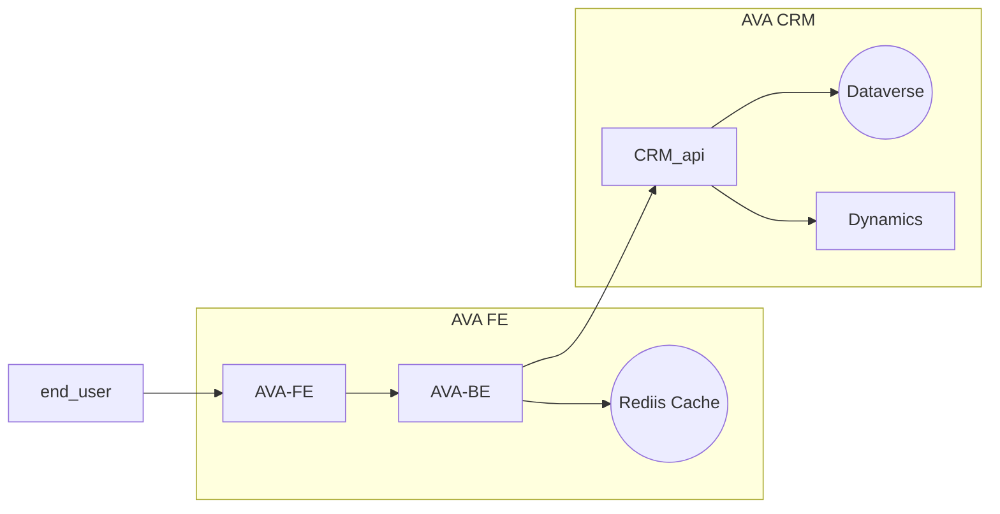

## README.md

This is the list of APIs that the va.gov UI will consume, in priority order. The priority was determined by:

1. Ping endpoint first, as the simplest test of the plumbing.
2. Form APIs before Dashboard APIs (since we'll be working on Forms first).
3. APIs that can only be fed by Dynamics APIs (data that only lives in Dynamics).
4. All other endpoints, in the general order that we plan to attack them.

## Hey! The Links Don't Work!

The links in this document are intentionally disabled. The AVA CRM Team and the AVA FE Team are currently collaborating on the API design and definitions. As the details are ironed out, the subordinate pages will be cleaned up and linked from this document.

## API Integration Status

|Color | Status | Description |
|---|---|---|
⬜ | Not Started | No dev work has been started |
🟨 | In Progress | dev work has started but not deployed to staging | 
🟧 | Paused | paused due to questions |
🟩 | Done | endpoint has been deployed to staging and verified |
🟥 | Blocked | there is an issue that neeeds addressing before blocker can be removed |

| Purpose | Artifact | AVA FE Endpoint | AVA CRM Endpoint | AVA CRM Status | FE Dev Status | Integration Status | Prod Deployment Status | Source | Notes | Docs | 
|---|---|---|---|:---:|:---:|:---:|:---:|:---:|---|---|
| Verify Connectivity between AVA FE API and AVA CRM API | Status | None | GET /ping | 🟩 | 🟨 | ⬜ | ⬜ | Dynamics | FE team has deployed and verified this in Dev. Waiting to deploy to staging for integration testing. | [link](Status_Ping.md) |
| Retrieve Categories | Form | GET /categories | GET /topics | 🟨 | ⬜ | ⬜ | ⬜| Dynamics | The AVA CRM endpoint is expected to return the entire categories/topics/subtopics tree | [link](Form_GetTopics.md) |
| Retrieve Topics | Form | GET /categories?[id] | GET /topics | 🟨 | ⬜ | ⬜| ⬜ | Dynamics | The AVA CRM endpoint is expected to return the entire categories/topics/subtopics tree | [link](Form_GetTopics.md) |
| Retrieve SubTopics | Form | GET /topic?[id] | GET /topics | 🟨 | ⬜ | ⬜ | ⬜| Dynamics | The AVA CRM endpoint is expected to return the entire categories/topics/subtopics tree | [link](Form_GetTopics.md) |
| Retrieve Messages to show on Front End | Form | GET /alerts | GET /alerts | ⬜| ⬜| ⬜ | ⬜ | Dynamics |  These have a start and expiration date | [link](Form_RetrieveBannerMessage.md) |
| Retrievestatus of an inquiry by inquiry number | Form | GET /inquiry?{num} | GET /inquiry?{num} | ⬜| ⬜ | ⬜ | ⬜ | Dynamics |  | | [link](Form_RetrieveInquiryStatus.md) |
| Get Medical Facilities (most of these are VAMCs) | Form | GET /facilities?[code] | | ⬜ | ⬜ | ⬜| ⬜ | Lighthouse | This will be retrieved from Lighthouse and filtered  | [link](Form_MedicalFacilities.md) |
| Get Education Facilities | Form | GET /schools?[code] | GET /schools?[code] | ⬜ |⬜ | ⬜ | ⬜| Dynamics |  | [link](Form_SchoolFacilityCodes.md) |
| Get Zip Codes for a state | Form | GET /zipcodes?{prefix} | GET /zipcodes?{prefix} | ⬜ |⬜ | ⬜| ⬜ | Dynamics |  | [link](Form_ZipCodes.md)  |
| Get States | Form | GET /states |  | ⬜ | ⬜ | ⬜ | ⬜| Static? | |  [link](Form_States.md) |
| Get Countries | Form | GET /countries | | ⬜ | ⬜ | ⬜| ⬜ | Static? | | [link] |
| Get User's Inquiries | Dashboard | GET /inquiries | GET /inquiries |  ⬜ | ⬜|  ⬜ | ⬜ | Dynamics | |  [link](Dashboard_RetrieveInquiries.md)  |
| Search for an inquiry by title text | Dashboard | GET /inquiries/search?{txt} | GET /inquiries/search?{txt} |  ⬜| ⬜ |  ⬜ | ⬜ | Dynamics | | [link] |
| Get the correspondence for an inquiry | Dashboard | GET /inquiry/{id}/replies | GET /inquiry/{num}/replies |  ⬜ |  ⬜| ⬜ | ⬜ | Dynamics | |  [link](Dashboard_RetrieveCorrespondence.md) |
| Submit a reply to an inquiry by inquiry number| Dashboard | PUT /inquiry/{num}/reply/new | PUT /inquiry/{num}/reply/new | ⬜| ⬜ |⬜ | ⬜ | Dynamics |  | [link](Dashboard_SubmitAReply.md) |
| Add an attachment to an inquiry | Dashboard | PUT /attachment/new?{num} | PUT /attachment/new?{num} |  ⬜ |  ⬜ | ⬜ | ⬜| Dynamics |  | [link](Dashboard_UploadFile.md) |
| Get an attachment by its id | Dashboard | GET /attachment?{id} | GET /attachment?{id} |  ⬜ | ⬜ | ⬜ | ⬜| Dynamics | | [link] |
| Get the user's profile information | Dashboard | GET /profile | GET /profile |  🟧 | ⬜| ⬜ | ⬜| VA Profile | There is information available in AVA Profile that is not contained in VA Profile.  We will use VA Profile to be the source of truth for any information it contains   We will fill the profile gaps with the informaiton from AVA Profile    **Note:** There must be a solution for distinguishing a business profile from a personal profile.  Currently that information is in AVA Profile. | [link](Dashboard_ReadMyProfile.md)  |
| Submit a new inquiry | Form | PUT /inquiry/new | PUT /inquiry/new |  🟧 | ⬜ | ⬜ | ⬜ | Dynamics | |  [link](Form_SubmitInquiry.md) |

## Overview of architecture and data flow

